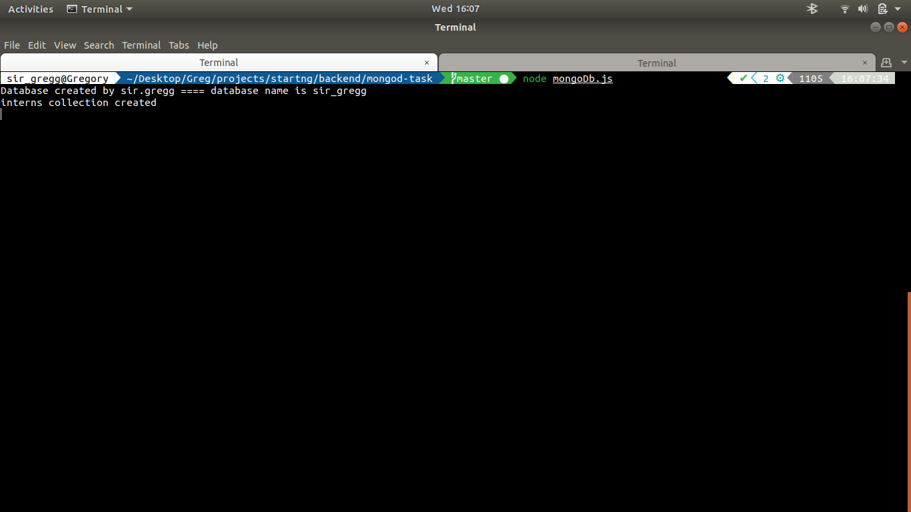

# mongodb-basics
Mongo DB is a non relational database.

## installation link
https://docs.mongodb.com/manual/installation/

## install on Ubuntu
https://docs.mongodb.com/manual/tutorial/install-mongodb-on-ubuntu/

## after installation, a screenshot displaying mongodb is running properly

## a screenshot displaying a database was created

## a screenshot displaying a collection named interns was created

## a screenshot displaying a record in the database

